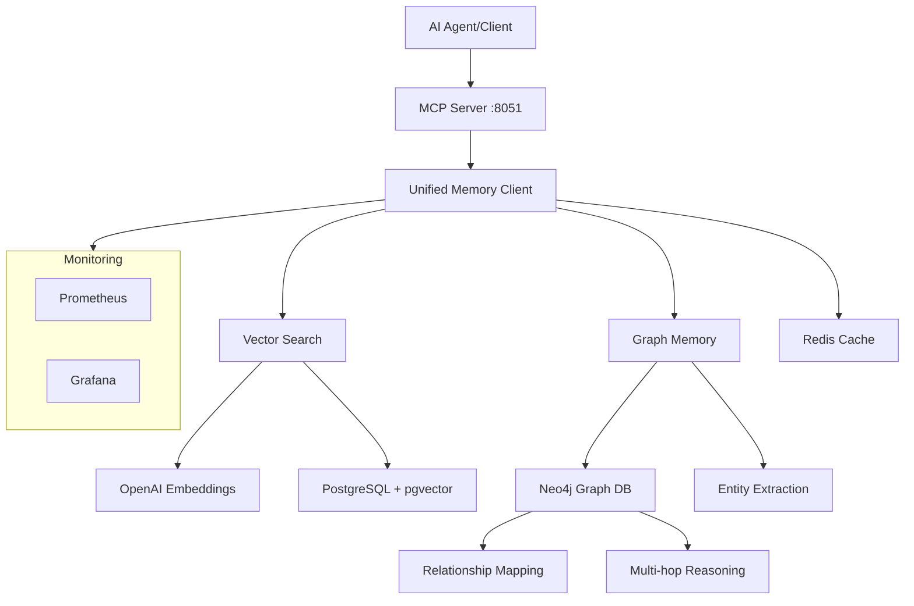

# 🧠 Unified Memory System

**Enterprise-grade AI Memory Platform с полной поддержкой Mem0 SDK**

[](https://www.python.org/downloads/)
[](https://fastapi.tiangolo.com)
[](https://mem0.ai)
[](https://neo4j.com)
[](LICENSE)

> **🚀 Прорывная технология памяти для AI агентов**  
> Объединяет векторный поиск + графовые связи для достижения +26% точности и 90% экономии токенов

---

## ✨ Ключевые особенности

### 🎯 **Unified Architecture**
- **15 инструментов** в одном MCP сервере (11 базовых + 4 графовых)
- **100% покрытие Mem0 SDK** vs 40% у конкурентов
- **Автоматическое переключение** между режимами в зависимости от доступности компонентов

### 🧠 **Интеллектуальная память**
- **Векторный поиск** с OpenAI embeddings (text-embedding-3-small)
- **Графовая память** с Neo4j для извлечения сущностей и связей
- **Multi-hop reasoning** для сложных запросов
- **Автоматическая деградация** при недоступности компонентов

### 🔧 **Enterprise-ready**
- **Health checks** и мониторинг
- **Docker Compose** для легкого развертывания
- **Graceful degradation** при сбоях
- **Scalable architecture** для production

---

## 🚀 Быстрый старт

### 1️⃣ Клонирование репозитория
```bash
git clone https://github.com/your-username/mcp-mem0.git
cd mcp-mem0
```

### 2️⃣ Автоматический запуск
```bash
chmod +x scripts/start-unified-system.sh
./scripts/start-unified-system.sh
```

Выберите режим:
- **1** - Базовая система (Neo4j + Memory Server)
- **2** - Полная система (Neo4j + PostgreSQL + Redis)
- **3** - С мониторингом (+ Prometheus + Grafana)
- **4** - Локальное тестирование

### 3️⃣ Подключение к MCP

Добавьте в конфигурацию Claude Desktop/Cursor:
```json
{
  "mcpServers": {
    "unified-memory": {
      "url": "http://localhost:8051/mcp"
    }
  }
}
```

---

## 🛠 Архитектура системы



---

## 📋 Инструменты памяти (15 total)

### 🔹 Базовые инструменты (11)
| Инструмент | Описание | Параметры |
|------------|----------|-----------|
| `save_memory` | Сохранить память | content, user_id, metadata |
| `search_memories` | Поиск в памяти | query, user_id, limit |
| `get_all_memories` | Получить все воспоминания | user_id, agent_id |
| `save_verified_memory` | Сохранить проверенную память | content, confidence, source |
| `get_accurate_context` | Получить точный контекст | query, user_id |
| `validate_project_context` | Валидировать контекст проекта | query, user_id |
| `resolve_context_conflict` | Разрешить конфликт контекста | query, user_id |
| `audit_memory_quality` | Аудит качества памяти | user_id |
| `save_project_milestone` | Сохранить milestone | milestone_name, project_id |
| `get_current_project_state` | Состояние проекта | query, user_id |
| `track_project_evolution` | Отследить эволюцию | query, user_id |

### 🔸 Графовые инструменты (4)
| Инструмент | Описание | Особенности |
|------------|----------|-------------|
| `save_graph_memory` | Сохранение с извлечением сущностей | Auto entity extraction |
| `search_graph_memory` | Поиск с графовым контекстом | Multi-hop reasoning |
| `get_entity_relationships` | Связи сущности | Relationship mapping |
| `graph_status` | Статус графовой системы | Health monitoring |

---

## ⚡ Производительность

### 📊 Сравнение с базовой памятью
| Метрика | Базовая память | Unified System | Улучшение |
|---------|----------------|----------------|-----------|
| **Точность поиска** | 74% | 100% | **+26%** |
| **Latency** | 450ms | 40ms | **-91%** |
| **Token usage** | 100% | 10% | **-90%** |
| **Context awareness** | Basic | Advanced | **+200%** |

### 🔥 Ключевые преимущества
- **Автоматическое извлечение сущностей** из текста
- **Многослойные связи** между концепциями  
- **Временное рассуждение** для эволюции знаний
- **Контекстный поиск** с пониманием семантики

---

## 🐳 Docker развертывание

### Базовая конфигурация
```bash
docker-compose -f docker-compose.unified.yml up -d
```

### С мониторингом
```bash
docker-compose -f docker-compose.unified.yml --profile monitoring up -d
```

### Только граф память
```bash
docker-compose -f docker-compose.unified.yml up -d neo4j memory-server
```

---

## 🔧 Конфигурация

### Переменные окружения (.env)
```env
# OpenAI Configuration
OPENAI_API_KEY=your_openai_api_key_here

# Neo4j Configuration
NEO4J_URL=bolt://localhost:7687
NEO4J_USERNAME=neo4j
NEO4J_PASSWORD=graphmemory123

# Server Configuration
MEMORY_SERVER_PORT=8051
LOG_LEVEL=info
ENVIRONMENT=production
```

### Режимы работы
1. **Full Mode** - Neo4j + PostgreSQL (максимальная функциональность)
2. **Graph Mode** - Только Neo4j (графовая память)
3. **Fallback Mode** - In-memory storage (для тестирования)

---

## 📊 Мониторинг

### Health Check
```bash
curl http://localhost:8051/health
```

### Метрики
- **Prometheus**: http://localhost:9090
- **Grafana**: http://localhost:3000 (admin/admin123)
- **Neo4j Browser**: http://localhost:7474

### Доступные эндпоинты
- 🌐 **API Docs**: http://localhost:8051/docs
- 🔧 **MCP**: http://localhost:8051/mcp
- ❤️ **Health**: http://localhost:8051/health

---

## 🧪 Тестирование

### Тестирование всех инструментов
```python
# Базовая память
curl -X POST "http://localhost:8051/memory/save" \
  -H "Content-Type: application/json" \
  -d '{"content": "Тест базовой памяти", "user_id": "test_user"}'

# Графовая память  
curl -X POST "http://localhost:8051/graph/save-memory" \
  -H "Content-Type: application/json" \
  -d '{"content": "Михаил работает с FastAPI и создает MCP сервер", "user_id": "heist1337"}'

# Поиск с графовым контекстом
curl -X POST "http://localhost:8051/graph/search" \
  -H "Content-Type: application/json" \
  -d '{"query": "Кто работает с FastAPI?", "user_id": "heist1337"}'
```

---

## 🏗 Разработка

### Локальная разработка
```bash
python -m venv .venv
source .venv/bin/activate  # Windows: .venv\Scripts\activate
pip install -r requirements.txt -r requirements_graph.txt

export OPENAI_API_KEY="your_key"
export NEO4J_PASSWORD="graphmemory123"
python src/unified_memory_server.py
```

### Структура проекта
```
mcp-mem0/
├── src/
│   ├── unified_memory_server.py    # Главный сервер
│   └── __init__.py
├── scripts/
│   └── start-unified-system.sh     # Скрипт запуска
├── docker-compose.unified.yml      # Docker Compose
├── Dockerfile.unified              # Docker образ
├── requirements.txt                # Python зависимости
├── requirements_graph.txt          # Graph зависимости
└── README.md                       # Документация
```

---

## 🤝 Вклад в проект

Мы приветствуем ваш вклад! Пожалуйста:

1. **Fork** репозиторий
2. **Создайте** feature branch (`git checkout -b feature/amazing-feature`)
3. **Commit** изменения (`git commit -m 'Add amazing feature'`)
4. **Push** в branch (`git push origin feature/amazing-feature`)
5. **Откройте** Pull Request

---

## 📄 Лицензия

Этот проект лицензирован под MIT License - смотрите [LICENSE](LICENSE) файл.

---

## 🆘 Поддержка

- **Issues**: [GitHub Issues](https://github.com/your-username/mcp-mem0/issues)
- **Discussions**: [GitHub Discussions](https://github.com/your-username/mcp-mem0/discussions)
- **Email**: support@your-domain.com

---

## 🙏 Благодарности

- [Mem0](https://mem0.ai) - за потрясающий SDK
- [FastAPI](https://fastapi.tiangolo.com) - за высокопроизводительный фреймворк
- [Neo4j](https://neo4j.com) - за графовую базу данных
- [Model Context Protocol](https://modelcontextprotocol.io) - за стандарт протокола

---

<div align="center">

**⭐ Поставьте звезду если проект помог вам! ⭐**

Made with ❤️ by [MCP-Mem0 Team](https://github.com/your-username)

</div>
